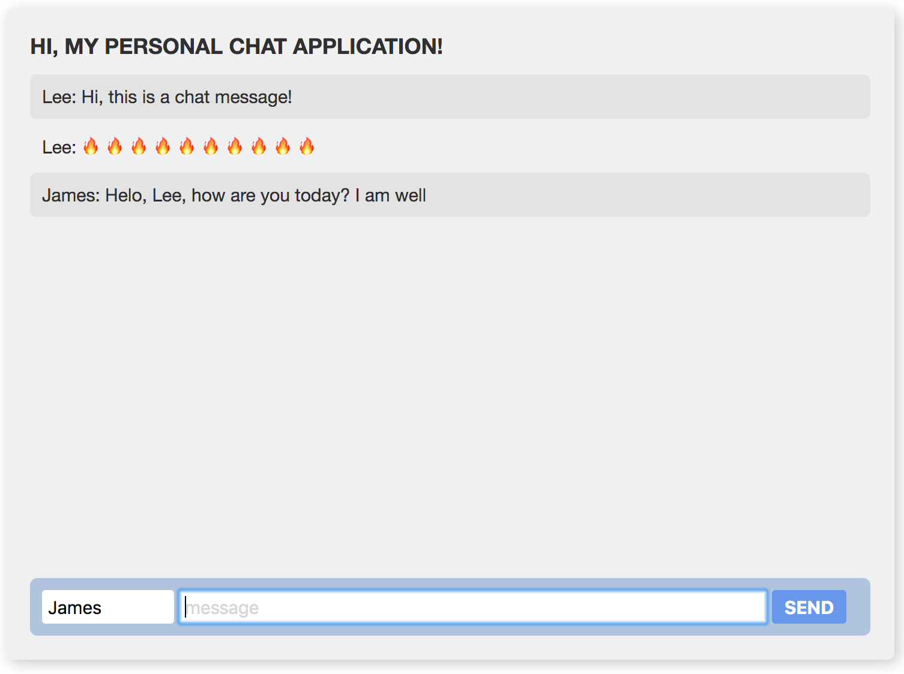

# Introduction

Welcome to the CIWA Summer 2019 Workshop! Today, we'll be learning all about web fundamentals: HTML, CSS, and JavaScript.

### Daily Schedule

Here's a rough look at how the day will go–this is in no way guaranteed \(except lunch, that's guaranteed\).

10:30am - Introduction / Setup  
11:05am - HTML  
11:20am - CSS - Intro  
11:30am - CSS Exercise  
  
**12:00pm - 12:30pm - Lunch!**  
  
12:30pm - JavaScript Basics  
1:30pm - Server / Client  
1:45pm - Implement sockets \(making your chat work with other people!\)  
2:15pm - Wrap-up / Stretch Goals  

### The Goal

Today's goal is to get acquainted with HTML, CSS and JavaScript-based web programming to create a simple chat application. You can think of it as your own personal Facebook Messenger! We'll be using modern tools and learn a lot over the course of the day. 

The objective is not to understand every single line of code, but to understand the basics of HTML, CSS, server-client relationships, and be inspired by how much can be created with so little code!

This is a sample of what we'll be making: [https://px43i.sse.codesandbox.io/](https://px43i.sse.codesandbox.io/)

