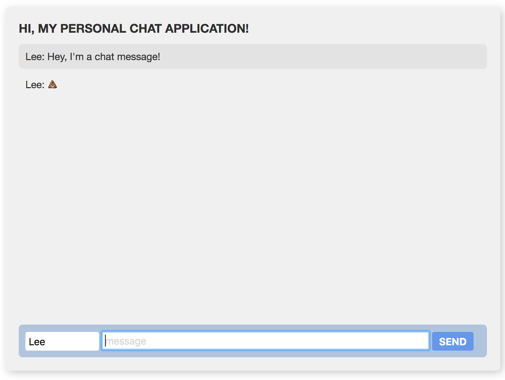
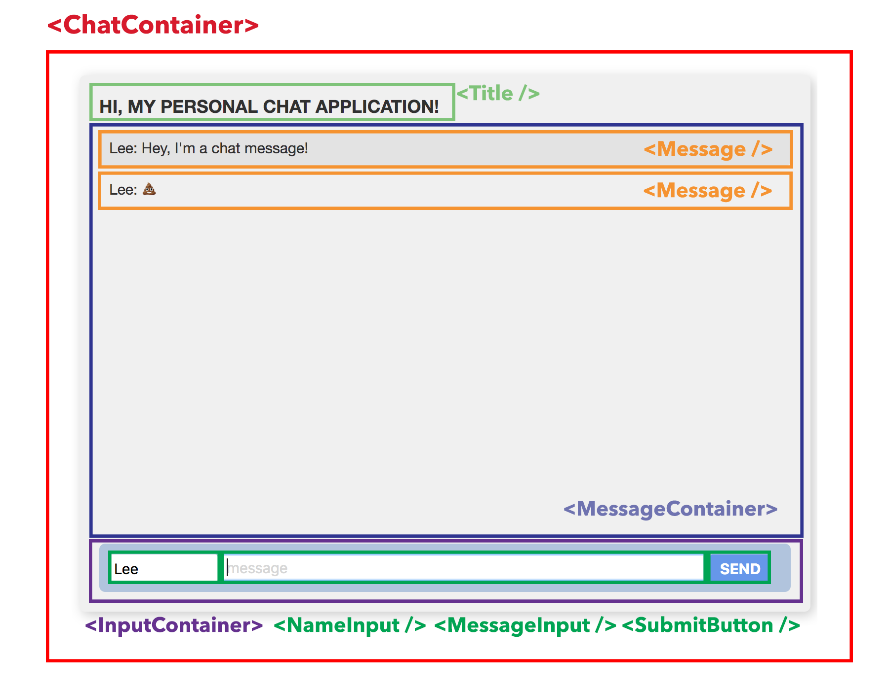
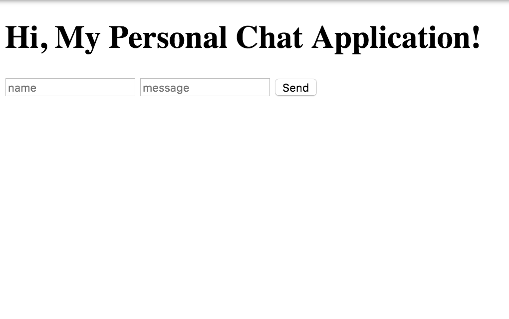

# HTML

### What is HTML?

HTML, or Hypertext Markup Language is a language for describing what the structure of your web application is. 

### Wait, what?

Let's think of your web application as a house. 


The **HTML is the frame and the drywall** of the house. It forms the shape and the structure, but without any paint on the walls, it's pretty plain and non-functional.

The **CSS \(Cascading Stylesheet\)** represents the **paint and design** of the house. The furniture, the pictures on the walls, the carpet–everything that makes your house look how you want it to look. 

The **JavaScript** represents the functionality of the house! You can think of it as the code that hooks the **doorbell** up and makes it work.

### Okay, so how do we describe the structure/frame of our web app?

We use what's commonly referred to as _**markup**_ to describe _**elements**_ with _**tags**_. The tags look like **&lt;this&gt;** and they have _**meaning!**_  Some examples of tags are `<p>` which **means** "paragraph" or a `<h1>` which means a "first-level heading". Most tags need a _**closing tag**_ which allows you to put text in-between the tags. `<p>I am a paragraph!</p>` - this means that all the text in-between the `<p>` and `</p>` is considered a "paragraph".

You may be asking yourself... who/what are we describing this structure to? Well, the answer to that is **the browser!**

It's up to your browser **\(Chrome, Firefox, Internet Explorer, Edge\)** to read this markup and determine how it looks. Most browsers interpret the markup the same with a few differences that we will not be covering today. Cross-browser support for websites could be it's own workshop!

#### Nesting

We indent our code when that content is _inside_ a tag \(between opening and closing tags\) so that it's easy to understand what code is inside other code.

#### Attributes

Attributes are options that exist on a tag. They look like this: `<h1 class="my-heading" id="my-heading-id">` where `class` and `id` are attributes. Elements can have zero or more attributes. Attributes are cool and come in handy later.

#### IDs / Classes

We give `id/class`'s to certain elements so that they can be quickly referenced later. This will be used in our CSS files to apply styling to specific elements. It will also be used to reference elements in our JavaScript!

### Let's look at the structure of our application



To build out our HTML, we should visually break out these elements into their distinct pieces. You'll see the word **container** used a lot–this is used to describe an element that _**contains**_ other elements. It's a way of semantically grouping elements together that make sense. Thinking of this again using the house analogy, you can think of a **container** as a room in your house. If you were to describe a living room **&lt;LivingRoomContainer&gt;**, it would have a **&lt;Lamp /&gt;, &lt;Painting /&gt;, &lt;Couch /&gt;** and maybe a **&lt;TV /&gt;**.



### Let's make that HTML!

Now,  HTML markup is all about following convention and semantics. Unfortunately, if you tell the browser that you want a `<ChatContainer>`, it has no idea what that is! Let's break these out into proper HTML elements. We'll talk about them a bit as we go. You're going to type the following code into your `index.html` file in-between your `<body> </body>` tags:

```markup
<main>
  <h1>Hi, My Personal Chat Application!</h1>
  <ol id="history"></ol>
  <form id="chat" action="">
    <input id="name" placeholder="name" />
    <input id="message" placeholder="message" autocomplete="off" />
    <button>Send</button>
  </form>
</main>
```

As you can see, our `<main>` tag is like our `<ChatContainer>`, our `<h1>` tag represents our title, and the `<ol>` represents our `<MessageContainer>` - you'll notice that it's empty but we'll get to that!

If everything went to plan, you should have something that looks like this:



It's still bland but it's a great start! Congratulations, you've scaffolded your first HTML webpage! Next, we'll start styling it to look better using **CSS**!

## Questions? Stuck? Please wave 👋🏻 down a mentor for assistance!


