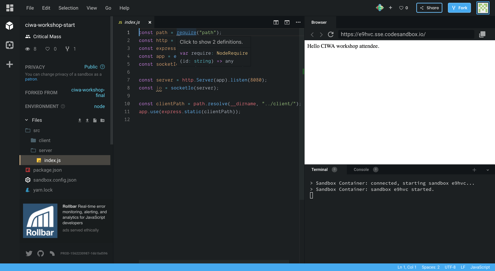
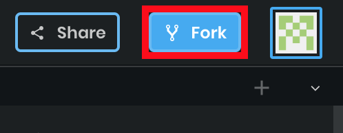
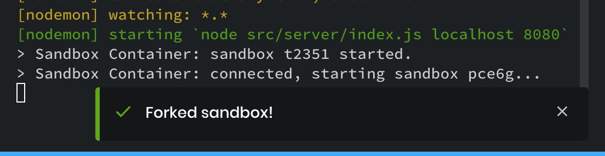
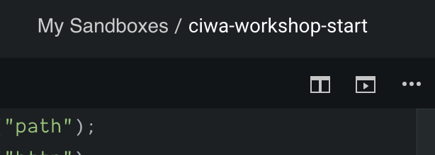
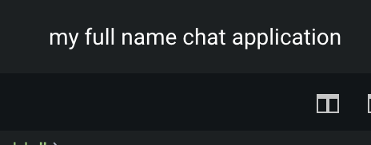

# Setup / CodeSandbox Intro

We'll be using a cool tool called **CodeSandbox** to write all our code today. **CodeSandbox** is what we call an IDE–an Integrated Development Environment. It allows us to write code and run it all in one spot. Normally, you'd have to setup a series of tools yourself with a ton of overhead and training to get everything working but **CodeSandbox** does that all for us. _Phew!_

### Sign-in to CodeSandbox

You should already be signed in at https://www.codesandbox.com. If you're not, please raise your hand and a mentor will help you out.

### Fork/Clone the App

We've done a bit of setup for this project that will help us get ahead. We'll be talking about how that setup has helped us and what it does exactly but only briefly. Don't worry too much about these details–today is about getting you writing code and _**making cool stuff**_ 👍🏻

Forking the app is easy. First, navigate to this URL:

### [https://codesandbox.io/s/ciwa-workshop-start-e9hvc](https://codesandbox.io/s/ciwa-workshop-start-e9hvc)

You'll be greeted with this screen. Click FORK in the top-right corner by the avatar!

When that's complete, you should see this little pop-up \(or the technical term, a _**toast**_ 🍞\) in the bottom right saying that the fork was successful!

Once you've forked it, we'll want to rename it so you can find it later on. Do this by clicking the title at the top-center of the window \(it should currently be **My Sandboxes/ciwa-workshop-start**\). Once you click it, you'll be able to edit the name. You can name it whatever you want but PLEASE put your full name in the title so you can identify it later with ease. 

Once this is all done, we're ready to go!

### If you need help and aren't at this stage, please raise your hand 👋🏻 and a mentor will come help you!

