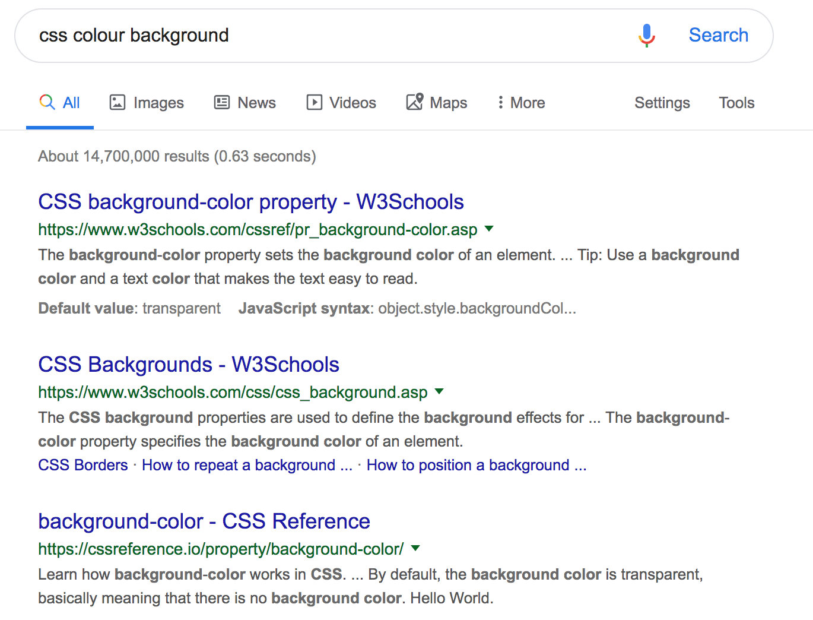
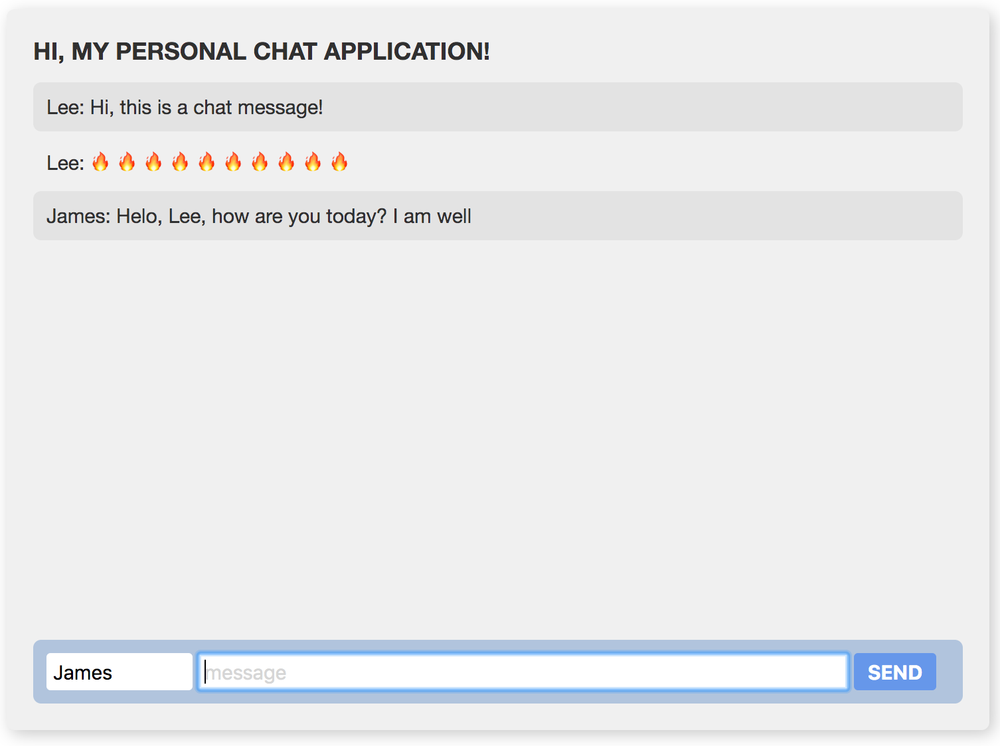

# CSS

Going back to our house analogy, **CSS** or **Cascading Stylesheets** is the **paint** for our house - it's what gives our **structure** personality, colour, and design! CSS is a language which helps us change the way our HTML page looks. A lot of times, CSS lives in a separate file from our HTML markup. 

A CSS block has two parts:

1. We need to tell the browser the name of the element we wish to style. We mostly do this using the element's tag name, `id`or `class`.
2. We then tell the browser what we want that element to look like, by specifying the "rules" or "styles" we want to apply to our element! You can customize a variety of things \(spacing, colours, sizes, styles, borders–you name it, it can likely be done\)

With this in mind, let's look at some CSS code and break it down.

```css
h1 {
  font-size: 18px;
  text-transform: uppercase;
  margin-top: 0px;
}
```

### Selectors & Rules

Our first piece, the `h1 {` is called our **selector.** We're telling the browser that we want to style **all the h1 elements on the page.** The content inside the `{ }` curly brackets are our **rules**. Each one consists of two parts: `<property-name>: unit/setting/option;` - so, in our example of `font-size: 18px;`, the property name is `font-size` and the unit is `18px`.  **Always make sure that every rule ends with a semi-colon!**

_**Extra reading**: What is a `px`? A px stands for **pixel**. A pixel is a single dot on a screen, and is used as a unit of measurement for font sizes, widths, heights, and distances._ 

There are a lot of different css properties, and while some apply to all HTML elements, others can only be used with specific elements. This is where Google helps out a **TON!** Let's say you want to change the background colour for our chat application, what would you Google? Probably "css colour background"! That will bring up these results:



There's a ton of resources online for web development and CSS is no exception to the rule. In general, when you Google for help, _**most**_ links will be helpful and not hindering. In particular, sites like **W3Schools, MDN, CSS-Tricks, and StackOverflow** will likely get you your answer most often.

If you Googled, you probably found that to change the colour of the background, you need to use the property `background-color`with a bit of a weird setting: `#f3f3f3` - **what the heck is that?** It's called a _**Hex Code**_ and it represents a colour. There's probably some fancy math to decode it but don't worry about that–we're going to use a handy tool for picking our colours visually: [https://html-color-codes.info/](https://html-color-codes.info/)

### Other Selectors

Above, we selected an element directly by calling `h1` \(the tag name\) but how can we be more specific? There's only so many element names available and we may not want them to all look the same! The answer? Attributes! The most common selectors you'll use are `classes` and `ids` but the method is a little quirky at first. Let's look at this HTML structure as an example:

```markup
<h1 class="my-heading">Hey there!</h1>
<p id="original-p">I'm a paragraph</p>
```

#### To select a class, you use the class value/name prefaced with a period: `.class-name`

So, in the above example, if we wanted to select the `h1` with the class `my-heading` and make it the colour red, we would use this selector/rule:

```css
.my-heading {
    color: red;
}
```

**Reminder:** Classes \(like surnames\) are not unique, so several different elements can have the same class name.

#### To select an ID, you use the ID value/name prefaced with a hashtag: `#id-name`

With that in mind, if we wanted to select the `p` with the id `original-p` and make it the colour pink, we would use this selector/rule:

```css
#original-p {
    color: pink;
}
```

**Reminder:** Ids are unique. Ids cannot be shared among HTML elements.

### Styling our structure

Let's start styling our chat application! First, we'll start with some base CSS. Go ahead and type this into your `client/style.css` file in your folder structure:

```css
body {
  background-color: white;
  color: #303030;
  font-family: "Helvetica Neue", Arial, sans-serif;
  font-size: 15px;
  margin: 20px;
}

main {
  border-radius: 6px;
  box-shadow: 3px 3px 12px #c8c8c8;
  margin: 20px auto;
  max-width: 700px;
  padding: 20px;
}

h1 {
  font-size: 18px;
  text-transform: uppercase;
  margin-top: 0px;
}

ol {
  list-style: none;
  margin-bottom: 20px;
  margin-top: 0;
  padding: 0;
  height: 400px;
  overflow: hidden;
  overflow-y: auto;
}

li {
  padding: 10px;
}


form {
  background-color: lightsteelblue;

  margin: 0;
  padding: 10px;
}

button {
  background-color: cornflowerblue;
  border: none;
  border-radius: 3px;
  color: white;
  font-size: 15px;
  font-weight: bold;
  padding: 5px 10px;
  text-transform: uppercase;
}

input {
  border: none;
  border-radius: 3px;
  font-size: 15px;
  padding: 5px;
}

::placeholder {
  color: #cccccc;
  opacity: 0.8;
}

#name {
  width: 100px;
}

#message {
  width: 480px;
}

```

### CSS Exercise

First, a reminder of how our application is supposed to look at the end:



You'll notice a few things are missing from the code up above! 

1. The `main` element \(or our `ChatContainer` \) doesn't have a **background color**.
2. The `form` or `InputContainer` should have a **rounded border**
3. Every second message is coloured differently and should have a **rounded border**

### We're going to take ~30 minutes to work independently and have you try to solve these issues! Use the existing CSS rules, Google, and mentors to help you out.


This section also allows you to add your own character to the application. Use the colour picker @ [https://html-color-codes.info/](https://html-color-codes.info/) to select any colour you want. Don't worry about it matching the picture exactly! Make this application yours 💯



