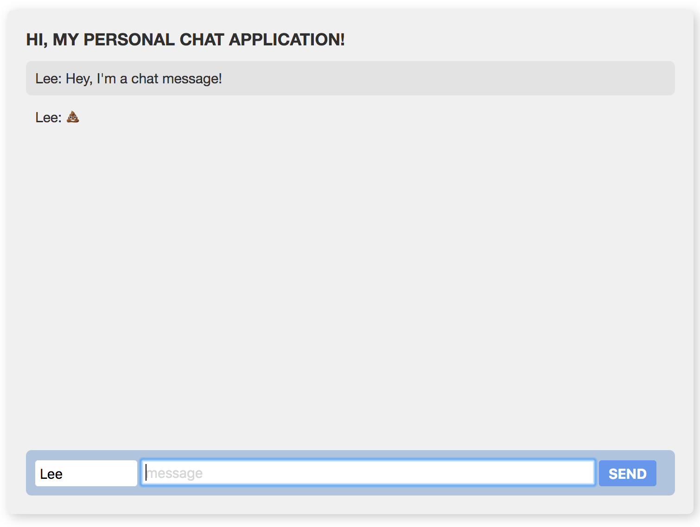
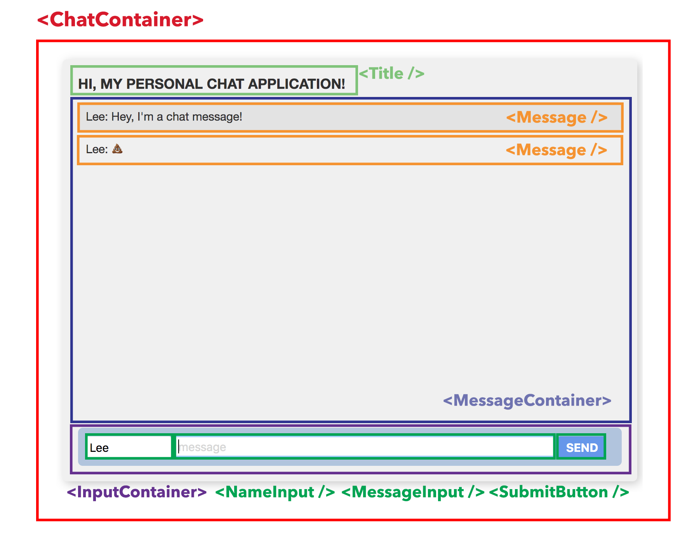

# HTML

### What is HTML?

HTML, or Hypertext Markup Language is a language for describing what the structure of your web application is. 

### Wait, what?

Let's think of your web application as a house. 


The **HTML is the frame and the drywall** of the house. It forms the shape and the structure, but without any paint on the walls, it's pretty plain and non-functional.

The **CSS \(Cascading Stylesheet\)** represents the **paint and design** of the house. The furniture, the pictures on the walls, the carpet–everything that makes your house look how you want it to look. 

The **JavaScript** represents the functionality of the house! You can think of it as the code that hooks the **doorbell** up and makes it work.

### Okay, so how do we describe the structure/frame of our web app?

HTML uses _**tags**_ to describe the structure of a web application. A tag consists of angled brackets &lt;..&gt; with words or letters inside. These words or letters are called _**elements**_, and are used to tell the browser what to display. For instance, a &lt;br&gt; tag tells the computer to start a new line in a paragraph. 

Elements that require a closing tag are _**container elements.**_ A closing tag has a forward slash \(/\), and the same tag name as the opening tag_**.**_ These tags wrap around text, images, or other elements. For instance, to make an html paragraph, we write down the start and closing &lt;p&gt;...&lt;/p&gt; tags, with the paragraph text in between:`<p>I am a paragraph!</p>` - this means that all the text in-between the `<p>` and `</p>` is considered a "paragraph".

To see what other kinds of tags are available, take a look at this [HTML cheat sheet](https://www.wired.com/2010/02/html_cheatsheet/). 

#### Nesting

We build up our web page through nesting, by putting tags inside of other tags. 

We indent our code when that content is _inside_ a tag \(between opening and closing tags\) so that it's easy to understand what code is inside other code.

#### Attributes

Attributes add more information about the elements for the browser. They look like this: `<h1 class="my-heading" id="my-heading-id">` where `class` and `id` are attributes. Elements can have zero or more attributes. Attributes are cool and come in handy later.

#### IDs / Classes

We give `id/class` attributes to certain elements so that they can be quickly referenced later. An id is like your first and last name, it can be used as a unique identifier! No two elements can have the same id. A class is used to identify a group of elements, just like your surname/family name can be used to identify members of your family. 

Both will be used in our CSS files to apply styling to specific elements. They will also be used to reference elements in our JavaScript!

### Let's look at the structure of our application



To build out our HTML, we should visually break out these elements into their distinct pieces. You'll see the word **container** used a lot–this is used to describe an element that _**contains**_ other elements. It's a way of  grouping elements together. Thinking of this again using the house analogy, you can think of a **container** as a room in your house. If you were to describe a living room **&lt;LivingRoomContainer&gt;**, it would have a **&lt;Lamp /&gt;, &lt;Painting /&gt;, &lt;Couch /&gt;** and maybe a **&lt;TV /&gt;**.



### Let's make that HTML!

Unfortunately, the browser only has a specific set of elements that it can understand. If you tell the browser that you want a `<ChatContainer>`, it has no idea what that is! Let's break these out into proper HTML elements. We'll talk about them a bit as we go. You're going to type the following code into your `index.html` file in-between your `<body> </body>` tags:

```markup
<main>
  <h1>Hi, My Personal Chat Application!</h1>
  <ol id="history"></ol>
  <form id="chat" action="">
    <input id="name" placeholder="name" />
    <input id="message" placeholder="message" autocomplete="off" />
    <button>Send</button>
  </form>
</main>
```

As you can see, our `<main>` tag is like our `<ChatContainer>`, our `<h1>` tag represents our title, and the `<ol>` represents our `<MessageContainer>` - you'll notice that it's empty but we'll get to that!

If everything went to plan, you should have something that looks like this:


It's still bland but it's a great start! Congratulations, you've created your first HTML webpage! Next, we'll start styling it to look better using **CSS**!

## Questions? Stuck? Please wave 👋🏻 down a mentor for assistance!


