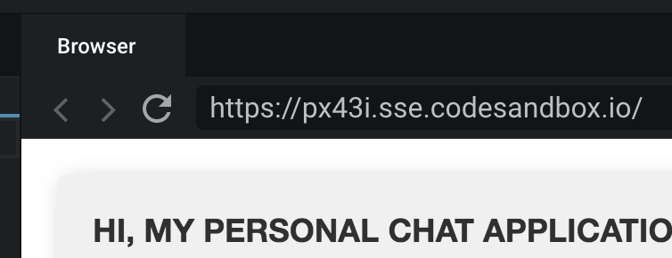
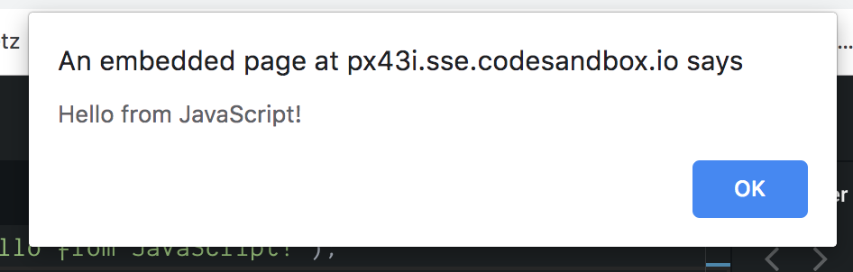

# JavaScript

Following our house analogy, **JavaScript** is the language that provides **functionality** \(remember the doorbell?\) to our house! JavaScript is a functional programming language–don't worry if that doesn't make sense at this point, it's not overly important for today. Let's break down some of the fundamental concepts for today.

### Variables

Variables are a way to assign a label or name to a value for re-use in your code. When you create a variable, it's called **declaring**. A **variable declaration** looks like this:

`const myAge = 10;`

Variables have three major parts: the type of variable \(`const` / `let`\), the name of the variable \(`myAge`\), and then the actual assigned value \(`10`\).  The entire **variable declaration** can also be referred to as a **statement**. A statement is **one contained** **instruction** for the computer the follow and should always be terminated/ended with a semi-colon `;`.

Don't worry too much if this isn't making a ton of sense. These concepts take time to understand and the best way to learn is to **do** and then look at the effect your code has. Things will start to fall in place!

### Values / Types

This could be a whole section of the class but we'll cover off a few of the basics that you'll use today. Variables can be assigned different **types** of values. 

* **Interger / Number**: This is represented as just a number like the above example: `const myAge = 10;`
* **String**: A string is a _**word**_ or _**sentence**_ that you want assigned to a variable. You must surround your string in quotes as if it were a speaking character in a story you were writing! Example: `const myName = "Lee Mulvey";`
* **Boolean**: A boolean is a bit of a silly word. A boolean can represent two distinct values: `true` or `false`. It's important that you do not surround it with quotes otherwise the computer will think it's a **string**, not a boolean! Example: `const isLeeTeaching = true;`
* **Objects**: These can be pretty complex. They're like a **collection** of **variable declarations.** Every property in an object has a **name** and a **value**. All of the properties are separated by a comma and surrounded by curly brackets `{ }`. If we were to put the above variables into an object, it would look like this: 

```javascript
const leeObject = {
    myAge: 10,
    myName: 'Lee Mulvey',
    isLeeTeaching: true
};
```

#### What do I do with variables?

Since they capture/refer to a value, you can reference them later. Let's say you have these two variables: `const five = 5;` and `const ten = 10;`, you could later create a NEW variable called `fifteen` and reference your other ones with a little math magic to create it: `const fifteen = five + ten;` . Variables can be passed around and assigned to each other, as well as assigned inside of objects. When accessing **nested properties** inside an **object**, you call it with the `objectName` and then a period, and then the `propertyName`. In practice, to pull up my name from the object above, you would call `leeObject.myName` and that would return `Lee Mulvey`. Variables are amazing!

### Functions

A function is set of instructions that you want the program to perform over and over again. Before we get into code, let's think of our doorbell again. What are the steps we want to happen while our doorbell is pushed?

1. Doorbell light turn on
2. Send signal to the doorbell speaker to trigger a DING sound

Okay, great! Now what about the instructions when our finger is taken off the doorbell?

1. Shut the doorbell light off
2. Send signal to the doorbell speaker to trigger a DONG sound

Cool! So, we've broken it out into two sets of instructions. It's important to note that these instructions are triggered by two distinct **events**: pushing the doorbell in, and letting go of it. We'll come back to events in a moment! First, let's break the first set of instructions out into actual JavaScript code:

```javascript
function onDoorbellPush() {
    Doorbell.lightOn = true;
    Doorbell.speaker.emit('DING');
};
```

A few things to note here. You'll see that functions are declared a bit differently than variables. You start your function with the word `function`! Next up is the name of the function itself, in this case, `onDoorBellPush`. You'll notice the empty brackets next to the name `()` - this is the spot where arguments would be placed. Arguments are like variables that can affect the outcome of function. Take for example a function that adds two numbers together:

```javascript
function addNumbers(number1, number2) {
    return number1 + number2;
};
```

In this example, if you call the function with two numbers: `addNumbers(10, 5);` it would return fifteen! The `return` keyword is another rabbit hole but it's important to note that functions can RETURN a value to be assigned. So, taking the above example again, if you wanted to create a new variable called fifteen with the **value** of `15`, you could use that function: `const fifteen = addNumbers(10, 5);`

**Whew!** That's a lot to take in. Let's break down how the instructions for the doorbell when we let go! As a reminder:

1. Shut the doorbell light off
2. Send signal to the doorbell speaker to trigger a DONG sound

Now in code:

```javascript
function onDoorbellRelease() {
    Doorbell.lightOn = false;
    Doorbell.speaker.emit('DONG');
};
```

There we go! Now, we're ready to attach that **functionality** to our **events.**

### **Events**

Events are a very common concept in programming, especially on the web. Events are triggered on a webpage when you `click` the mouse, `move` your mouse, hit a key on the keyboard \(`keypress`\), and even when you browse on your phone and tap on the screen \(`onTapStart`\). 

Events allow us to tie functionality to things we do on the web. Now, let's look at a "real world" event by attaching our doorbell functions to events. Typically an `eventListener` looks is a pre-existing function that takes two arguments: the `eventName`, and the action/function to perform when that event occurs!

`House.addEventListener('doorbellPush', onDoorbellPush);`

See? The first argument, `'doorbellPush'` is the NAME of the event we want to listen for \(notice that it's a **STRING!\),** and the second argument `onDoorbellPush` is just a reference to the function we already made! With that in mind, can you guess how we would attach an event on releasing the doorbell?

`House.addEventListener('doorbellRelease', onDoorbellRelease);`

Woo! Those are events. We'll be using the concept of events with **Sockets** coming up. You can think of **sockets** as a way to emit and listen for events between you \(the client/browser\) and a web server. More on that soon!

## Okay, enough chatting: let's write some JavaScript.

I agree. Let's write your first code. Open up your `client/script.js` and type the following code:

```text
alert('Hello from JavaScript!');
```

Click the refresh button above your 'browser':



And then you should see the following pop-up. If you don't, wave a mentor down!



There! Your first JavaScript code. Now let's start implementing our **chat functionality!**

## Questions? Super confused? 👋🏻 down a mentor and we'll try to clear some of this up. Don't worry if it doesn't ALL make sense. It will start to fall into place as we apply it in our chat app!

