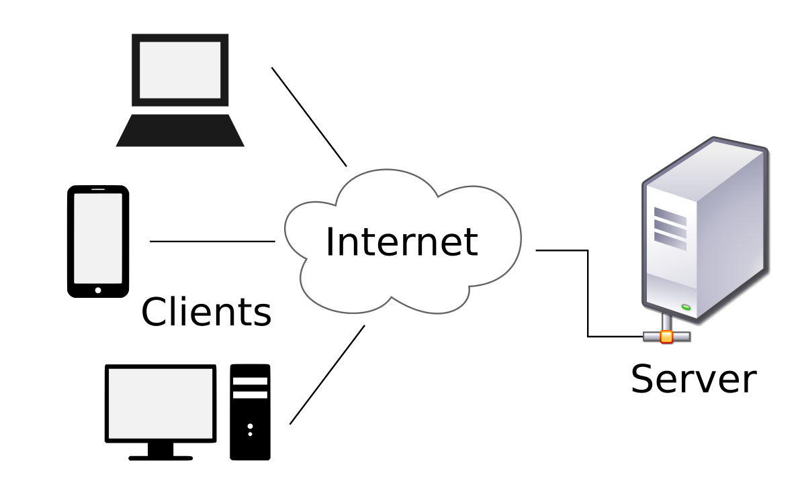
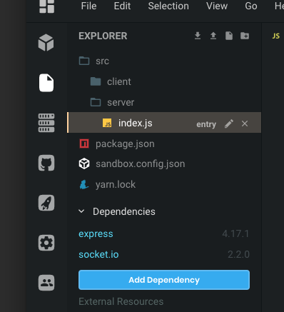

# Web Server

Up until this point we've been only been working with code that runs in your web browser. We call this the "client side" code. To let our users send chat messages to each other, we will need to build a web server that will send and receive chat messages to all the connected users.

Up until this point we've been working exclusively with code that runs in your web browser. We like to call this "client side" code. To let our users send chat messages to each other, we will need to build a web server that will send and receive chat messages to all the connected users.



For this workshop we will building our server using  **Node.js**. **Node.js** allows us to write **JavaScript** code that will run on a web server. This way, for our chat application we will be using the same language \(**JavaScript**\) on both the client and the server.

The good news is you've already been using **Node.js** to run your application. When you navigate to your webpage, your browser sends an **HTTP Request** to the server. The server then responds back to your browser with the **HTML**, **CSS** and **JavaScript** that we've already created in this workshop. It's what allows us to see all the awesome work we've already finished!

Lets take a minute to inspect some of the code that we've provided for you that allows you to run your work in your web browser.  To follow along, please navigate to the server code found in the server folder in your CodeSandbox project.



The code inside **"/src/server/index.js"** will look like the following.



```text
const path = require("path");
const http = require("http");
const express = require("express");
const app = express();

const clientPath = path.resolve(__dirname, "../client/");
app.use(express.static(clientPath));

const server = http.Server(app).listen(8080);

// Ignore this code for now, we will get to this later.
// const socketIo = require("socket.io");
// const io = socketIo(server);

```




You will notice at the bottom of this file \(lines 11-13\) some of the code we will need is commented out. This means is a neat way of writing code that will be ignored by the server.  If you would like to comment out some of your code, you can do this by starting any line with "//". Developers use comments to add extra information about the code that they have written. 


### Code Explanation

#### Web Server Dependencies

```text
const path = require("path");
const http = require("http");
const express = require("express");
const app = express();
```

For our chat application to work, we will be using some code that other people have already written. In programming and in **Node.js** specifically we call these "**dependencies**". For today's workshop you don't really need to know how this works. But basically we are importing several dependencies that help us create and run a web server. 

```text
const clientPath = path.resolve(__dirname, "../client/");
app.use(express.static(clientPath));

const server = http.Server(app).listen(8080);
```

This code is using the dependencies that we've including into our code to create and start a web server that will serve our static assets \(HTML, JavaScript & CSS\). 

